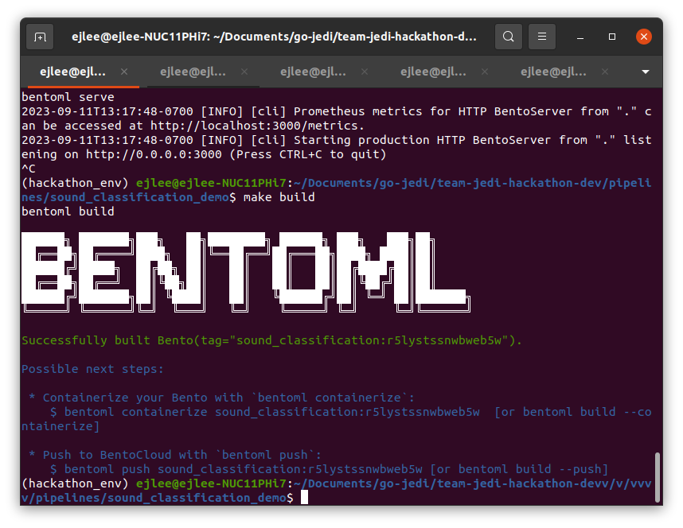
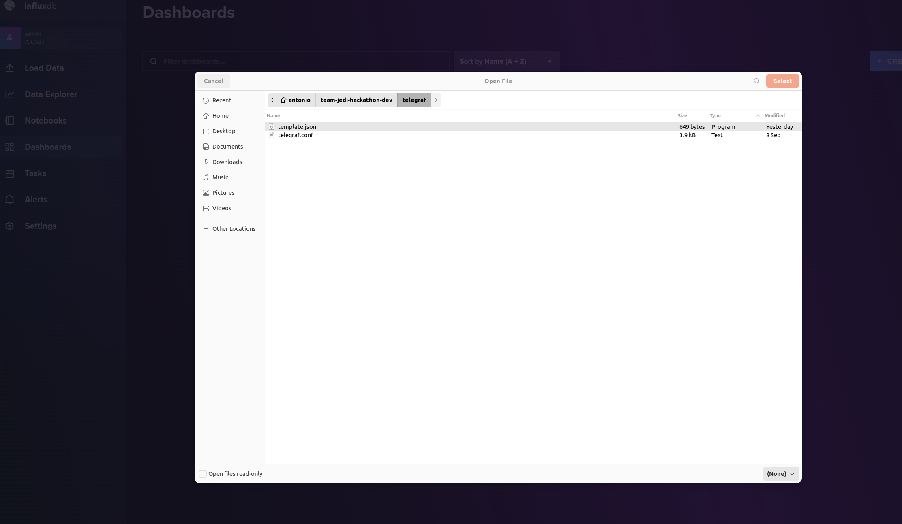

# Team Jedi Hackathon
## Overview
This project allows developers to send a single channel sound file to a sound detection pipeline connected to business logic. 
The business logic parses the inference results as data that is exported to InfluxDB, a time-series database.
This time-series data can then be viewed on a Grafana dashboard and customized to send email notifications.

-  **Programming Languages:** Python, Golang
-  **Technologies used :** Docker, Docker Compose, Make, Conda, BentoML, Telegraf, InfluxDB, Grafana 
-  **Intel OpenSource Technologies used:** OpenVino, OpenVino Model Server (OVMS), EdgeX

## Target System Requirements
-  **Disk Space needed**

### Dependencies:
- Docker v24.0.0
- Docker Compose v2.17.3
- Golang v1.20
- [Conda Environment](https://docs.conda.io/projects/miniconda/en/latest/miniconda-install.html) with Python v3.8
- Sample Audio File - must be single channel and `.wav` format

## Microservice descriptions:

### BentoML Sound Detection Pipeline

BentoML is a Unified Model Serving Framework which makes it easy to create ML-powered prediction services that are ready to deploy and scale. BentoML easily wraps the ML pipelines around web services. It is used by Data Scientists and ML Engineers to:

1. Accelerate and standardize the process of taking ML models to production

2. Build scalable and high performance prediction services

3. Continuously deploy, monitor, and operate prediction services in production

Learn more: [BentoML](https://docs.bentoml.org/en/latest/)

Open Source Repository: [GitHub](https://github.com/bentoml/BentoML)

Get Started on BentoML: [Tutorial](https://docs.bentoml.org/en/latest/tutorial.html)

#### Workflow

1. Sound Classification Pipeline python example from the OpenVino Model Zoo is adopted and modified to build the ML pipeline for this use case.

2. Bentos are created for this sound classification pipeline.

3. BentoML is now used to build & deploy these Bentos docker containers.

4. These Bentos can be tested using the [Swagger APIs](http://0.0.0.0:3000/). (Explained in detail below)

5. This ML pipeline sends the following inference data to the business logic microservice -

    ```json
    inference_results: {'timestamp': '2023-09-13 21:10:31.500582', 'inputVideo': '${HOME}/team-jedi-hackathon-dev/media/ak47s_gun_sound_mono.wav', 'inference': [{'videoTimestamp': '[0.00-1.00]', 'label': 'Gunshot', 'accuracy': '100.00%'}, {'videoTimestamp': '[1.00-2.00]', 'label': 'Door knock', 'accuracy': '15.64%'}], 'latency': 9.321213001385331}
    ```

<figure class="figure-image">

<figcaption>ML Pipeline Service Development & Deployment Workflow</figcaption>
</figure>

More examples for developing with BentoML can be found here for the [AiCSD project](https://intel.github.io/AiCSD/pipelines/bentoml/developer-guide-bentos.html)

### Business Logic Application Service

The microservice for the business logic is developed using the the golang-based Edgex app services. Sound Classification microservice sends POST request with the inference data to the business logic microservice. Here the inference results are stored in the InfluxDB which are then queried to display the results on the Grafana dashboard.

### Data Export Application Service

This is a golang-based EdgeX example that provides the ability to export data from the EdgeX Stack.
The example allows EdgeX Events and Reading to be sent to InfluxDB using line protocol. 
This project utilizes the exporter to take data sent via MQTT on a specified topic and export it to InfluxDB using the MQTT Sender, a topic specific to InfluxDB and Telegraf. 

## How It Works


Figure 1: Architecture Diagram

In this project, a single-channel, wav-format sound file is sent over REST from the Swagger UI to the BentoML Sound Detection Pipeline container. 
This container then calls OpenVino Model Server (OVMS) Docker container over gRPC to get the model status. 
The Sound Detection Pipeline container will then run the Python inferencing and send the inference results over REST to the business logic application service.
The business logic container is then responsible for parsing the inference results and sending it via MQTT to the data export service.
The Data Export service takes the MQTT results and sends them over MQTT to InfluxDB. 
InfluxDB is responsible for storing the time-series data that is then visualized in a Grafana dashboard. 
The Grafana dashboard is configured for viewing inference results and sending email notifications.

## Get Started
Provide step-by-step instructions for getting started.

1. Install the listed [dependencies](#dependencies).
2. Configure `DOCKER_INFLUXDB_INIT_PASSWORD` and `DOCKER_INFLUXDB_INIT_ADMIN_TOKEN` in the `.env` file for InfluxDB.

3. Build the business logic container.
    ```bash
    cd app-sample-service
    make docker
    cd ..
    ```

4. Create a Conda working environment, configure it, and activate.
    ```bash
    conda create -n hackathon_env python=3.8
    conda activate hackathon_env
    cd pipelines/sound_classification_demo
    pip install -r requirements.txt
    cd ../..
    ```
   
    !!! Note
        Use `conda list` to verify all packages in requirements.txt are installed.

5. Build the BentoML sound detection pipeline service
    ```bash
    cd pipelines/sound_classification_demo
    make build
    ```

    !!! Note
        To build and run the docker image, the build tag from the `make build` command is required.
    
    The following is the expected output from the build command:

    

    Figure 2: BentoML Build Output

6. **[Optional]** Build the BentoML Docker Image from the `pipelines/sound_classification_demo` directory.
    ```bash
    make docker-build BENTO_TAG=<bento_image_name>:<bento_image_tag>
    ```
   
    !!! Note
        In the example above, the `BENTO_TAG` would be `BENTO_TAG=sound_classification:r5lystssnwbweb5w`.

## Run the Application

1. Configure the type of sound you want to get notified with. 
Update the `docker-compose-apps.yml` line 18, and add sounds based on the file in here `models/aclnet-int8/aclnet_53cl.txt`

Each item must be in a comma separated:

```
SOUNDS: "Gunshot,Door knock"
```

2. Run the stack of services from the project root directory.
    ```bash
    make run
    ```
    **[Optional]** Run Portainer for container management.   
    ```bash
    make run-portainer
    ```
3. Start the BentoML service from the `pipelines/sound_classification_demo` directory.

    | Run Method | Run Command |
    |------------|-------------|
    | Locally    | `make serve` |
    | Docker     | `make docker-run BENTO_TAG=<bento_image_name>:<bento_image_tag> PROJECT_REPO_PATH=<project_repo_path>`            |

    !!! Note
        In the example from setup, the `BENTO_TAG` would be `BENTO_TAG=sound_classification:r5lystssnwbweb5w`.
        The `PROJECT_REPO_PATH` is the full path to the `team-jedi-hackathon-dev` project.

4. Open the [Swagger API UI](http://0.0.0.0:3000/).
5. Test a POST request to the `/classify` API by providing the input text as
    ```json
    {
      "MediaPath": "[PATH]/team-jedi-hackathon-dev/media/ak47s_gun_sound_mono.wav",
      "ModelPath": "[PATH]/team-jedi-hackathon-dev/models/aclnet/1/aclnet_des_53.xml",
      "LabelPath": "[PATH]/team-jedi-hackathon-dev/models/aclnet/aclnet_53cl.txt", 
      "GatewayIP":"XXX.XXX.X.X", 
      "Port":"9001"
    }
    ```
   
    !!! Success
        If the pipeline runs successfully, the Response Code will be 200 and the Response Body will look like `Success, inference_results: {'timestamp': '2023-09-13 21:10:31.500582', 'inputVideo': '/home/ejlee/Documents/go-jedi/team-jedi-hackathon-dev/media/ak47s_gun_sound_mono.wav', 'inference': [{'videoTimestamp': '[0.00-1.00]', 'label': 'Gunshot', 'accuracy': '100.00%'}, {'videoTimestamp': '[1.00-2.00]', 'label': 'Door knock', 'accuracy': '15.64%'}], 'latency': 9.321213001385331}`
6. To further verify the pipeline ran successfully, check the logs of the BentoML Pipeline container. The example below shows the logs from [Portainer](http://0.0.0.0:9000)

   
    Figure 3: Portainer container log screenshot

7. Open the [Grafana Dashboard](http://0.0.0.0:3001/grafana) to see the visualization of the inference results.

8. Open [influxDB](http://0.0.0.0:8086/grafana) to visualize data as well. Use `admin` as username and the password set inside the `.env` file.

Go to the dashboard section:


Import the file `telegraf/template.json`



Click on `Sound Dashboard`


Once in the dashboard, increase the refresh rate to 10s:


## API Documentation
> If your microservices expose APIs, document each API endpoint, including its purpose, input parameters, expected output, and any authentication/authorization requirements.
> Provide sample API requests and responses for clarity.

## Testing
> Discuss the testing approach you followed for your microservices.
> Document unit tests, integration tests, and any other types of tests performed.
> Include instructions on how to run the tests.

## Summary and Next Steps
>Note: Provide 2-3 line description of what the user has successfully done and
>where they should go to as the next step.

## Troubleshooting

1. While building the Sound Classification pipeline microservices using BentoMl, several package dependecy issues can be resolved by using conda environment. Make sure all packages are installed before building & running them.

1. Sound Classification pipeline from OpenVINO model zoo didn't work initially. Raised [issue](https://github.com/openvinotoolkit/open_model_zoo/issues/3858) using github to get support on the same from the OpenVINO team.

1. Access Grafana Dashboard using this link - http://0.0.0.0:3001/grafana. Accessing the link directly from portainer (http://0.0.0.0:3001) results in error as it doesn't append **grafafana** to the link.

